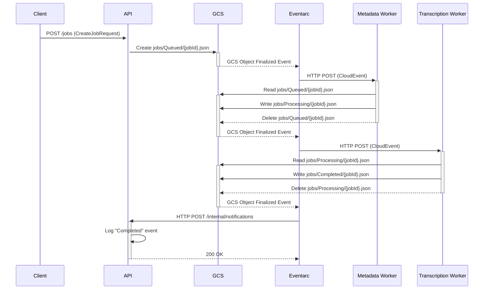

# Data Flow Documentation

This document outlines the end-to-end data flow of the system, from the initial API request to the final processing notification. The system employs a state-triggered choreography pattern using Google Cloud Storage (GCS) and Eventarc Advanced.

## 1. Initial Job Creation

The data flow begins when a client sends a `POST` request to the `/jobs` endpoint of the **API service**.

**Component:** `packages/api`
**Endpoint:** `POST /jobs`
**Handler:** `packages/api/src/routes/jobs.ts`

### Request Payload

The request body must conform to the `CreateJobRequest` schema:

```typescript
export const CreateJobRequest = Schema.Struct({
  media: Media.MediaResource,
  idempotencyKey: Schema.optional(Schema.String),
  transcriptionContext: Schema.optional(Transcription.TranscriptionContext)
})
```

-   **`media`**: A `MediaResource` object specifying the media to be transcribed (e.g., a YouTube video URL).
-   **`idempotencyKey`** (optional): A unique key to prevent duplicate job submissions.
-   **`transcriptionContext`** (optional): Provides context to the transcription model.

### Process

1.  The `createJobHandler` receives the request.
2.  It calls the `createTranscriptionJob` service (`packages/api/src/services/job-creation.ts`) to create a `QueuedJob` object. This object includes a unique `jobId`, a `requestId`, and timestamps.
3.  The handler interacts with the `JobStore` (`packages/storage/src/JobStore.ts`), which in turn uses the `JobRepository`.
4.  The `JobRepository` (`packages/storage/src/JobRepository.ts`) serializes the `QueuedJob` object to JSON and uploads it to GCS.

### GCS Output

-   **Bucket**: The shared artifacts bucket (e.g., `ingestion-shared-artifacts-xxxxxx`).
-   **Path**: `jobs/Queued/{jobId}.json`

This action of writing a file to the `jobs/Queued/` directory is the first state transition and serves as the trigger for the next stage of the process.

## 2. State Transition: Queued to Processing

When a job file is created in the `jobs/Queued/` directory, it triggers the metadata processing stage via Eventarc.

**Trigger:** GCS Object Finalized event in `jobs/Queued/`
**Component:** `packages/worker-metadata`

### Eventarc Flow

1.  A GCS `object.v1.finalized` event is generated.
2.  The **GoogleApiSource** (`gcs-events`) captures this event and publishes it to the central **MessageBus**.
3.  The **Metadata Worker Enrollment** (`metadata-worker`) has a CEL filter that matches the event:
    -   `message.type == "google.cloud.storage.object.v1.finalized"`
    -   `message.source` ends with the bucket name.
    -   `message.subject` starts with `objects/jobs/Queued/`.
4.  Upon a match, the event is forwarded to the **Metadata Worker Pipeline** (`metadata-worker`).
5.  The pipeline sends the event as an HTTP POST request to the **Metadata Worker Cloud Run service**.

### Inferred Worker Logic

The `worker-metadata` service performs the following actions:

1.  Receives the CloudEvent from the pipeline.
2.  Parses the event to get the GCS path of the job file.
3.  Reads the `QueuedJob` JSON file from GCS.
4.  (Inferred) Performs metadata-related tasks, such as validating the `media` resource or enriching the job with additional data.
5.  Calls `JobRepository.updateJobStatus` to transition the job state. This function atomically moves the job file from the `Queued` folder to the `Processing` folder.

### GCS Output

-   **Old Path (Deleted)**: `jobs/Queued/{jobId}.json`
-   **New Path (Created)**: `jobs/Processing/{jobId}.json`

This state transition triggers the next worker in the choreography.

## 3. State Transition: Processing to Completed

The appearance of a job file in the `jobs/Processing/` directory triggers the `transcription-worker`.

**Trigger:** GCS Object Finalized event in `jobs/Processing/`
**Component:** `packages/worker-transcription`

### Eventarc Flow

The Eventarc flow is identical to the previous step, but with a different enrollment and pipeline:

1.  A GCS `object.v1.finalized` event is generated for the new file in `jobs/Processing/`.
2.  The event is published to the **MessageBus**.
3.  The **Transcription Worker Enrollment** (`transcription-worker`) matches the event based on its CEL filter (`message.subject` starts with `objects/jobs/Processing/`).
4.  The event is forwarded to the **Transcription Worker Pipeline** (`transcription-worker`).
5.  The pipeline sends the event to the **Transcription Worker Cloud Run service**.

### Inferred Worker Logic

The `worker-transcription` service performs the core transcription task:

1.  Receives the CloudEvent from the pipeline.
2.  Reads the `ProcessingJob` JSON file from GCS.
3.  (Inferred) Executes the transcription process based on the job's `media` and `transcriptionContext`. This may involve calling external services or using an ML model.
4.  Upon successful transcription, it calls `JobRepository.updateJobStatus` to transition the job to the "Completed" state.

### GCS Output

-   **Old Path (Deleted)**: `jobs/Processing/{jobId}.json`
-   **New Path (Created)**: `jobs/Completed/{jobId}.json`

This is the final state transition for a successful job, which triggers the notification process.

## 4. Final Notification

Once a job file appears in the `jobs/Completed/` directory, a final notification is sent to the API service to log the completion event.

**Trigger:** GCS Object Finalized event in `jobs/Completed/`
**Component:** `packages/api`

### Eventarc Flow

1.  A GCS `object.v1.finalized` event is generated for the new file in `jobs/Completed/`.
2.  The event is published to the **MessageBus**.
3.  The **Notifications Enrollment** (`notifications`) matches the event based on its CEL filter (`message.subject` starts with `objects/jobs/Completed/`).
4.  The event is forwarded to the **Notifications Pipeline** (`notifications`).
5.  The pipeline sends the event to the **API service** at the `/internal/notifications` endpoint.

### API Logic

The `api` service handles this final event:

1.  The `internalRoutes` (`packages/api/src/routes/internal.ts`) receives the CloudEvent.
2.  The `handleNotification` function is called, which routes to the `handleCompletedJob` handler based on the event's subject.
3.  The `handleCompletedJob` function creates a `JobStatusChanged` domain event.
4.  This event is stored in GCS in the `events/` directory for a permanent, immutable log. It is also stored in a Key-Value store for quick lookups.
5.  The handler returns a `200 OK` response to the pipeline, acknowledging receipt of the event.

This concludes the successful data flow for a transcription job.

## 5. Error Handling

If a worker encounters an unrecoverable error during processing, it transitions the job to a `Failed` state.

### Process

1.  A worker (e.g., `worker-transcription`) catches an exception.
2.  It calls `JobRepository.updateJobStatus` with the status set to `Failed` and includes an error message.
3.  The `JobRepository` moves the job file from its current directory (e.g., `jobs/Processing/`) to the `jobs/Failed/` directory.

### GCS Output

-   **New Path (Created)**: `jobs/Failed/{jobId}.json`

The file in the `jobs/Failed/` directory can then be used for debugging and manual intervention. The final notification step will also be triggered for failed jobs, allowing the system to log the failure event.

## 6. Data Flow Diagram

